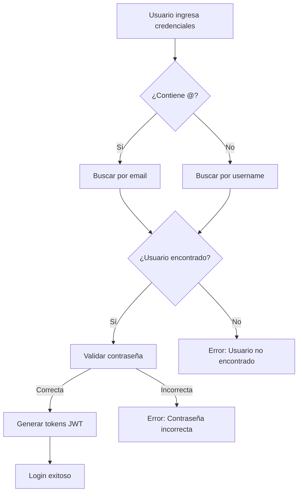

# 🔐 Login con Email o Username

Esta funcionalidad permite a los usuarios iniciar sesión usando tanto su **email** como su **nombre de usuario**, proporcionando mayor flexibilidad y mejor experiencia de usuario.

## 📋 Características Implementadas

### ✅ Backend (Django)
- **Serializer personalizado**: `CustomTokenObtainPairSerializer` modificado
- **Búsqueda inteligente**: Detecta automáticamente si es email o username
- **Validación robusta**: Manejo de errores y casos edge
- **Case-insensitive**: Funciona con mayúsculas y minúsculas

### ✅ Frontend (Next.js)
- **Campo unificado**: Un solo input para email o username en login
- **Interfaz adaptativa**: Cambia el placeholder y label según el contexto
- **Validación dinámica**: Diferentes tipos de input para login vs registro
- **UX mejorada**: Instrucciones claras para el usuario

## 🔧 Implementación Técnica

### Backend - Serializer Personalizado

```python
class CustomTokenObtainPairSerializer(TokenObtainPairSerializer):
    username_field = 'login'  # Campo personalizado
    
    def validate(self, attrs):
        login_value = attrs.get('login')
        password = attrs.get('password')
        
        # Buscar por email si contiene @
        if '@' in login_value:
            user = User.objects.get(email=login_value.lower())
        else:
            # Buscar por username
            user = User.objects.get(username=login_value.lower())
        
        # Validar contraseña y generar tokens
        # ...
```

### Frontend - Interface Actualizada

```typescript
export interface LoginCredentials {
  login: string;  // Puede ser email o username
  password: string;
}
```

### Componente de Login

```tsx
<input
  type={isLogin ? 'text' : 'email'}
  name="email"
  placeholder={isLogin ? 'tu@email.com o @usuario' : 'tu@email.com'}
  // ...
/>
```

## 🧪 Casos de Prueba

### 1. Login con Email
```bash
POST /api/auth/login/
{
  "login": "usuario@ejemplo.com",
  "password": "mipassword123"
}
```

### 2. Login con Username
```bash
POST /api/auth/login/
{
  "login": "mi_usuario",
  "password": "mipassword123"
}
```

### 3. Case Insensitive
```bash
# Todos estos funcionan:
"login": "USUARIO@EJEMPLO.COM"
"login": "usuario@ejemplo.com"
"login": "MI_USUARIO"
"login": "mi_usuario"
```

## 🎯 Flujo de Autenticación



## 🚀 Cómo Probar

### 1. Prueba Automática
```bash
cd backend
python ../test-login-methods.py
```

### 2. Prueba Manual
1. Ve a `http://localhost:3000`
2. En la pantalla de login, prueba con:
   - **Email**: `molo@molo.com`
   - **Username**: `molo`
   - **Contraseña**: `molo123456`
3. Ambos métodos deberían funcionar

### 3. Prueba con API
```bash
# Con email
curl -X POST http://localhost:8000/api/auth/login/ \
  -H "Content-Type: application/json" \
  -d '{"login": "molo@molo.com", "password": "molo123456"}'

# Con username
curl -X POST http://localhost:8000/api/auth/login/ \
  -H "Content-Type: application/json" \
  -d '{"login": "molo", "password": "molo123456"}'
```

## 📱 Experiencia de Usuario

### Antes
- ❌ Solo login con email
- ❌ Los usuarios debían recordar su email exacto
- ❌ Menos flexibilidad

### Después
- ✅ Login con email O username
- ✅ Mayor flexibilidad para los usuarios
- ✅ Mejor UX y accesibilidad
- ✅ Interfaz más intuitiva

## 🔒 Seguridad

### Medidas Implementadas
- **Validación robusta**: Verificación de contraseña en ambos casos
- **Case-insensitive**: Búsqueda normalizada (lowercase)
- **Rate limiting**: Protección contra ataques de fuerza bruta
- **Mensajes genéricos**: No revela si el usuario existe o no

### Consideraciones
- Los mensajes de error son genéricos para evitar enumeration attacks
- La búsqueda es case-insensitive para mejor UX
- Se mantiene la misma seguridad que el login tradicional

## 🐛 Troubleshooting

### Error: "Credenciales inválidas"
- Verifica que el usuario exista en la base de datos
- Confirma que la contraseña sea correcta
- Revisa que no haya espacios extra en el input

### Error: "Campo login requerido"
- Asegúrate de enviar el campo `login` en lugar de `email`
- Verifica que el frontend esté usando la nueva interface

### Login funciona con email pero no con username
- Confirma que el username existe en la base de datos
- Verifica que no haya caracteres especiales problemáticos
- Revisa los logs del servidor para más detalles

## 🔄 Migración desde Login Solo Email

Si ya tienes usuarios existentes:

1. **No se requiere migración** - Los usuarios pueden seguir usando su email
2. **Funcionalidad adicional** - Ahora también pueden usar su username
3. **Retrocompatible** - El sistema anterior sigue funcionando

## 📈 Métricas y Analytics

Para trackear el uso:

```python
# En el serializer, puedes agregar logging
import logging

logger = logging.getLogger(__name__)

def validate(self, attrs):
    login_value = attrs.get('login')
    
    if '@' in login_value:
        logger.info(f"Login attempt with email: {login_value}")
    else:
        logger.info(f"Login attempt with username: {login_value}")
    
    # ... resto de la lógica
```

## 🎉 Beneficios

- **UX mejorada**: Los usuarios pueden elegir cómo iniciar sesión
- **Flexibilidad**: Funciona con email o username indistintamente
- **Accesibilidad**: Más fácil recordar username que email completo
- **Modernidad**: Estándar en aplicaciones modernas
- **Retrocompatibilidad**: No rompe funcionalidad existente